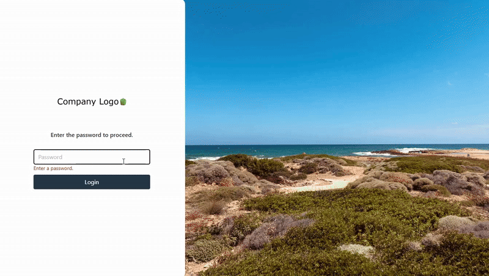

# PowerShell Automation Agent

A full-stack web application for web-controlled PowerShell execution on managed Windows hosts.



## How to Run

### Installation
1. Download the latest build artifacts from the [Releases](../../releases) page
2. Extract to your installation directory (e.g., `C:\PowerShellAutomationAgent`)

### Configuration
Edit `appsettings.json` with your database and authentication settings:
- Update `ConnectionStrings:Postgres` for your PostgreSQL database
- Set a secure `JwtOptions:Secret` (minimum 32 characters)
- Configure `Access:Password`

### Service Setup
Create and start the Windows service as Administrator:
```powershell
sc.exe create PowerShellAutomationAgent binPath="C:\PowerShellAutomationAgent\PowerShellAutomationAgent.API.exe" start=auto
sc.exe start PowerShellAutomationAgent
```

### Access
The application will be available at `http://localhost:5000`

**Logs:** `C:\ProgramData\PowerShellAutomationAgent\logs`

## Future Enhancements
- Cron-Like scheduling for recurring jobs
- (Better) Webhook triggers for executing scripts
- Email notifications on job completion or failure.
- Script versioning
- (Better) Secret management
